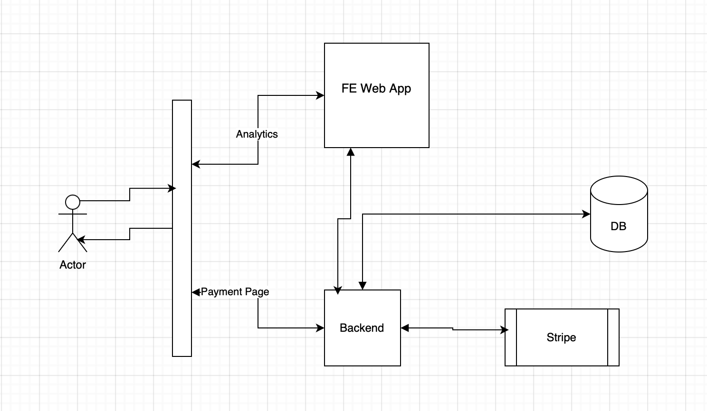
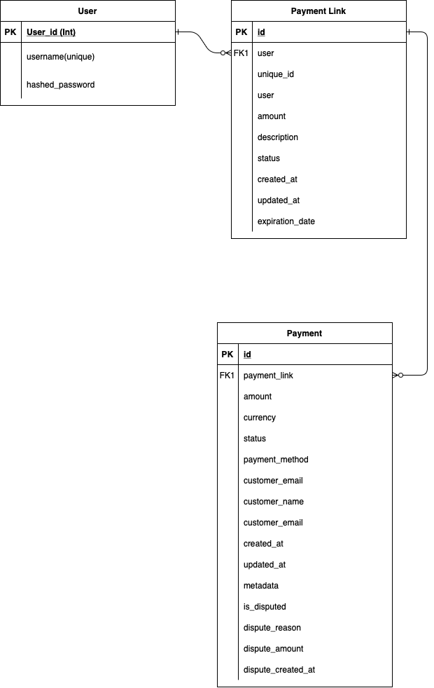

# Architecture

## Architecture Diagram

## ER Diagram

## Technologies
- Django
- Django Rest Framework
- Stripe
- PostgreSQL    

## Flow
1. When a user creates a payment link, it is stored in the **PaymentLink** model.
2. Whenever the user clicks the payment link, they are taken to the **Custom Payment Page**.
3. The **Custom Payment Page** is built using Stripe Elements, which is a secure and customizable payment form hosted on the backend Django server.
4. The payment intent is created on the server side, and the client secret is sent to the custom payment page.
5. The payment is processed, and the user is redirected to the success or failure page, which is hosted on the backend Django server.
6. The payment details are stored in the **Payment** model.
7. The backend server exposes a webhook that receives payment success/failure events from Stripe and updates the **Payment** model.
8. The **Analytics API** is responsible for tracking the payment status and other metrics.

## Usage of AI Tools
I used **Cursor AI** with **Claude 3.5 Sonnet** to write the code for the project. I also used **Claude Sonnet** to discuss the architecture with the AI and get feedback on the design.

### Example Prompts:
1. "How to create a payment link in Django?"
2. "How to create a custom payment page using Stripe Elements?"
3. "How to create a webhook in Django to receive payment success/failure events from Stripe?"
4. "How to track the payment status and other metrics using an analytics API?"
5. "Generate HTML page for success and failure."
